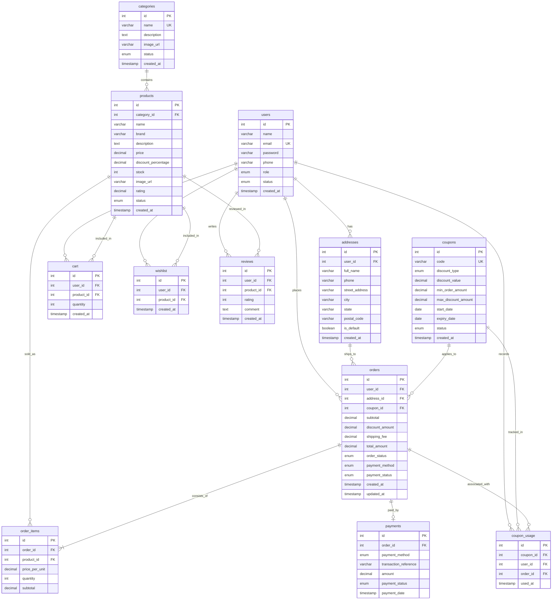

# ShopSphere — Database Entity Relationship (ER) Diagram

This document illustrates the complete relational schema design of the ShopSphere database matching `database/shopsphere.sql`.

```mermaid
erDiagram
    users ||--o{ addresses : "has"
    users ||--o{ orders : "places"
    users ||--o{ cart : "owns"
    users ||--o{ wishlist : "saves"
    users ||--o{ reviews : "writes"
    users ||--o{ coupon_usage : "records"

    categories ||--o{ products : "contains"

    products ||--o{ cart : "included_in"
    products ||--o{ wishlist : "included_in"
    products ||--o{ order_items : "sold_as"
    products ||--o{ reviews : "reviewed_in"

    addresses ||--o{ orders : "ships_to"

    coupons ||--o{ orders : "applies_to"
    coupons ||--o{ coupon_usage : "tracked_in"

    orders ||--|{ order_items : "consists_of"
    orders ||--o| payments : "paid_by"
    orders ||--o{ coupon_usage : "associated_with"

    users {
        int id PK
        varchar name
        varchar email UK
        varchar password
        varchar phone
        enum role
        enum status
        timestamp created_at
    }

    addresses {
        int id PK
        int user_id FK
        varchar full_name
        varchar phone
        varchar street_address
        varchar city
        varchar state
        varchar postal_code
        boolean is_default
        timestamp created_at
    }

    categories {
        int id PK
        varchar name UK
        text description
        varchar image_url
        enum status
        timestamp created_at
    }

    products {
        int id PK
        int category_id FK
        varchar name
        varchar brand
        text description
        decimal price
        decimal discount_percentage
        int stock
        varchar image_url
        decimal rating
        enum status
        timestamp created_at
    }

    cart {
        int id PK
        int user_id FK
        int product_id FK
        int quantity
        timestamp created_at
    }

    wishlist {
        int id PK
        int user_id FK
        int product_id FK
        timestamp created_at
    }

    coupons {
        int id PK
        varchar code UK
        enum discount_type
        decimal discount_value
        decimal min_order_amount
        decimal max_discount_amount
        date start_date
        date expiry_date
        enum status
        timestamp created_at
    }

    orders {
        int id PK
        int user_id FK
        int address_id FK
        int coupon_id FK
        decimal subtotal
        decimal discount_amount
        decimal shipping_fee
        decimal total_amount
        enum order_status
        enum payment_method
        enum payment_status
        timestamp created_at
        timestamp updated_at
    }

    order_items {
        int id PK
        int order_id FK
        int product_id FK
        decimal price_per_unit
        int quantity
        decimal subtotal
    }

    payments {
        int id PK
        int order_id FK
        enum payment_method
        varchar transaction_reference
        decimal amount
        enum payment_status
        timestamp payment_date
    }

    reviews {
        int id PK
        int user_id FK
        int product_id FK
        int rating
        text comment
        timestamp created_at
    }

    coupon_usage {
        int id PK
        int coupon_id FK
        int user_id FK
        int order_id FK
        timestamp used_at
    }
```
