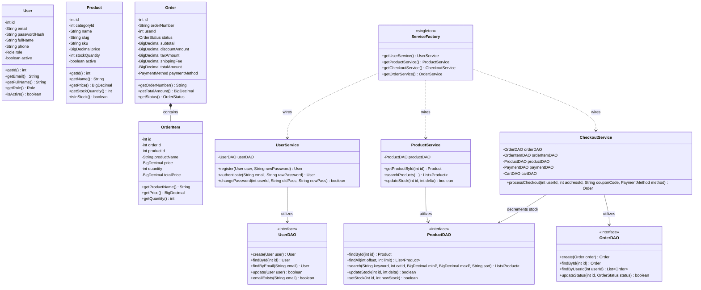

# ShopSphere — Core Class Diagram

This diagram visualizes the primary domain models, data access objects, and business services comprising the `shopsphere-core` engine.

```mermaid
classDiagram
    %% Core Models
    class User {
        -int id
        -String email
        -String passwordHash
        -String fullName
        -String phone
        -Role role
        -boolean active
        +getId() int
        +getEmail() String
        +getFullName() String
        +getRole() Role
        +isActive() boolean
    }

    class Product {
        -int id
        -int categoryId
        -String name
        -String slug
        -String sku
        -BigDecimal price
        -int stockQuantity
        -boolean active
        +getId() int
        +getName() String
        +getPrice() BigDecimal
        +getStockQuantity() int
        +isInStock() boolean
    }

    class Order {
        -int id
        -String orderNumber
        -int userId
        -OrderStatus status
        -BigDecimal subtotal
        -BigDecimal discountAmount
        -BigDecimal taxAmount
        -BigDecimal shippingFee
        -BigDecimal totalAmount
        -PaymentMethod paymentMethod
        +getOrderNumber() String
        +getTotalAmount() BigDecimal
        +getStatus() OrderStatus
    }

    class OrderItem {
        -int id
        -int orderId
        -int productId
        -String productName
        -BigDecimal price
        -int quantity
        -BigDecimal totalPrice
        +getProductName() String
        +getPrice() BigDecimal
        +getQuantity() int
    }

    %% DAO Interfaces
    class UserDAO {
        <<interface>>
        +create(User user) User
        +findById(int id) User
        +findByEmail(String email) User
        +update(User user) boolean
        +emailExists(String email) boolean
    }

    class ProductDAO {
        <<interface>>
        +findById(int id) Product
        +findAll(int offset, int limit) List~Product~
        +search(String keyword, int catId, BigDecimal minP, BigDecimal maxP, String sort) List~Product~
        +updateStock(int id, int delta) boolean
        +setStock(int id, int newStock) boolean
    }

    class OrderDAO {
        <<interface>>
        +create(Order order) Order
        +findById(int id) Order
        +findByUserId(int userId) List~Order~
        +updateStatus(int id, OrderStatus status) boolean
    }

    %% Service Classes
    class UserService {
        -UserDAO userDAO
        +register(User user, String rawPassword) User
        +authenticate(String email, String rawPassword) User
        +changePassword(int userId, String oldPass, String newPass) boolean
    }

    class ProductService {
        -ProductDAO productDAO
        +getProductById(int id) Product
        +searchProducts(...) List~Product~
        +updateStock(int id, int delta) boolean
    }

    class CheckoutService {
        -OrderDAO orderDAO
        -OrderItemDAO orderItemDAO
        -ProductDAO productDAO
        -PaymentDAO paymentDAO
        -CartDAO cartDAO
        +processCheckout(int userId, int addressId, String couponCode, PaymentMethod method) Order
    }

    class ServiceFactory {
        <<singleton>>
        +getUserService() UserService
        +getProductService() ProductService
        +getCheckoutService() CheckoutService
        +getOrderService() OrderService
    }

    %% Relationships
    Order *-- OrderItem : contains
    UserService --> UserDAO : utilizes
    ProductService --> ProductDAO : utilizes
    CheckoutService --> OrderDAO : utilizes
    CheckoutService --> ProductDAO : decrements stock
    ServiceFactory ..> UserService : wires
    ServiceFactory ..> ProductService : wires
    ServiceFactory ..> CheckoutService : wires
```
